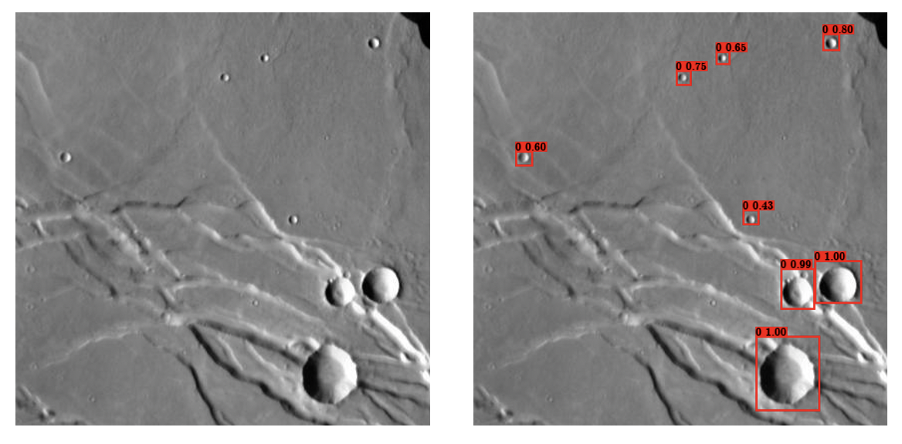

Automated crater detection based on the YOLOv3 architecture and its application to CTX imagery -- Code
============================
#### yj319@ic.ac.uk
#### CID: 01776029

## Overview
A Crater Detection Algorithm (CDA) based on YOLOv3 neural network, with support for 
retraining, evaluating on the THEMIS images, evaluating on the CTX images, detecting 
craters on images input by users. The report of this software is available [here](https://github.com/acse-2019/irp-acse-yj319/tree/master/FinalReport). 
You can also replicate the results included in the report by using this software.

## Installation
#### Clone and install requirements
    $ git clone https://github.com/acse-2019/irp-acse-yj319
    $ cd Code/
    $ sudo pip3 install -r requirements.txt
#### Download prerequisites
Owing to the size limit of GitHub repository (100 MB), we can not upload all the files 
in our work. As a substitute, we upload some necessary files as a zip file via Google Drive 
and paste a link [here](https://drive.google.com/file/d/1dM7_xLsdX-mbgWNoCiUsP4JfygUpWloz/view?usp=sharing) 
for user to download.

This zip file (3.7 GB) contains our trained weights，training images, original CTX images of our
investigation region, Robbins carter dataset (Robbins & Hynek, 2012) and also the 
visualized detection results of our model on THEMIS test set. 
####
    $ ls 
    RobbinsCraters_tab.txt	data_images		weights
    THEMIS_results		original_CTX
To ensure the integrity and availability of the software，users need to 
place these files in the specified path: 
#####
    .
    └── Code
        ├── CTX
        │   ├── original_CTX
        │   └── RobbinsCraters_tab.txt
        ├── Data
        │   └──  data_images
        └── weights
* The structure tree only include the files you downloaded from Google Drive, guiding you to put them in the right place
* Please keep the path of other files unchanged
* The directory 'THEMIS_results' contains the visualized result on THEMIS test set, no need to place it anywhere

As above zip file is large in size (3.7 GB), we also provide you a condensed version 
[here](https://drive.google.com/file/d/1OnNCMPx8RnaYEi8Pu1YqwjzLo657dcCB/view?usp=sharing) (218 MB). 
The condensed version only contains the trained weights, which allows you to play around with our CDA by detecting
craters on images you input. Simply put the directory 'weights/' in ' Code/' is ok. However, if you do want replicate
our results on THEMIS and CTX images or retraining the model, please download the full version.

## Detecting craters on your own images

With the weights file downloaded from Google Drive, you can use the CDA to detect the craters in images of planetary surfaces.

####
    $ python predict.py
By running 'predict.py', the images in 'img/' will be detected automatically. We have already prepared some example images for
you, and you can also drop your own images in 'img/' for automated crater detection. The result will be saved in 'pred_imgs/'.

## Crater detection on THEMIS images
####
    $ python themis_eval.py
The default IoU threshold is set as 0.3. You can also use a different IoU threshold by using a optional argument.
####
    $ python themis_eval.py --iou_thres 0.5
The performance of the model will be printed out after the whole process.

The CDA will not save the result as images, as they are large in number. You can view our result from 'THEMIS_results' directory, which you
downloaded from Google Drive.

## Crater detection on CTX images
####
    # pre-process original CTX images
    $ cd CTX/
    $ python CTX_pre-processing.py
    
    # conduct crater detections on CTX tiles
    $ cd ..
    $ python ctx_eval.py
You need to pre-process the original CTX images before applying the CDA on it. The pre-processing is
already integrated in 'CTX_pre-processing.py'. By running the command lines above, the crater detection
on CTX images will be carried on. The default size of resized images is 1248x1248, and the size range of craters
to be detected is 1-32 km in diameter. You can also parse arguments for different settings. For example, to apply
crater detections on 2080x2080 CTX images for craters in the size range of 0-4 km in diameter:
####
    $ cd CTX/
    $ python CTX_pre-processing.py --resized_size 2080 --min 0 --max 4
    $ cd ..
    $ python ctx_eval.py --resized_size 2080 --min 0 --max 4
Also, for easier trying on this, we already provided processed CTX tiles in this repository.
The processed CTX tiles are cropped from 1248 by 1248 resized images, and detecting size range is 1-32 km.
Simply give it a try by using command line:
####
    $ python ctx_eval.py
After applying crater detection on CTX images, the detection result will be visualized in a panoramic view
of our investigation region of Mars. Red bounding boxes represent craters detected by our model, while light
blue bounding boxes represent craters in Robbins crater dataset.

## Retrain the model
####
    $ usage: train.py [-h] [--CUDA CUDA] [--weights WEIGHTS]
                [--start_epoch START_EPOCH] [--end_epoch END_EPOCH] [--lr LR]
                [--bs BS] [--val_split VAL_SPLIT]

    YOLOv3 training

    optional arguments:
      -h, --help                         show this help message and exit
      --CUDA CUDA (bool)                 use CUDA or not, False as default
      --weights WEIGHTS (str)            pre-trained weights to be loaded, "./weights/yolo_weights.pth" as default
      --start_epoch START_EPOCH (int)    start epoch, 0 as default
      --end_epoch END_EPOCH (int)        end epoch, 70 as default
      --lr LR (float)                    learning rate, 1e-4 as default
      --bs BS (int)                      batch size, 8 as default
      --val_split VAL_SPLIT (float)      proportion of validation set, 0.1 as default
The default values of above parameters are same as what we used for training our model.
#### example:
    $ python train.py --start_epoch 0 --end_epoch 20 --lr 1e-3 --bs 20 --val_split 0.2
The figure for training log will generate after the training process and the weights file will be saved
in 'weights/' directory after each epoch.

## Reference and Credit:

#### Authors of YOLOv3: 
Joseph Redmon & Ali Farhadi, 
[Paper](https://pjreddie.com/media/files/papers/YOLOv3.pdf), [Project Webpage](https://pjreddie.com/darknet/yolo/), [Authors' Implementation](https://github.com/pjreddie/darknet).

#### Tutorials and other open source code referenced or used
* https://blog.paperspace.com/how-to-implement-a-yolo-object-detector-in-pytorch/
* https://blog.csdn.net/weixin_44791964/article/details/105310627
* https://www.bilibili.com/video/BV1Hp4y1y788
* https://github.com/ayooshkathuria/pytorch-yolo-v3
* https://github.com/bubbliiiing/yolo3-pytorch
* https://github.com/BobLiu20/YOLOv3_PyTorch
* https://github.com/qqwweee/keras-yolo3
* https://github.com/eriklindernoren/PyTorch-YOLOv3
* https://gitee.com/benjiaxu/yolov4-keras

### More detailed explanations of scripts and files in this work can be found from doc strings, comments lines as well as README files in some sub-directories.

    

